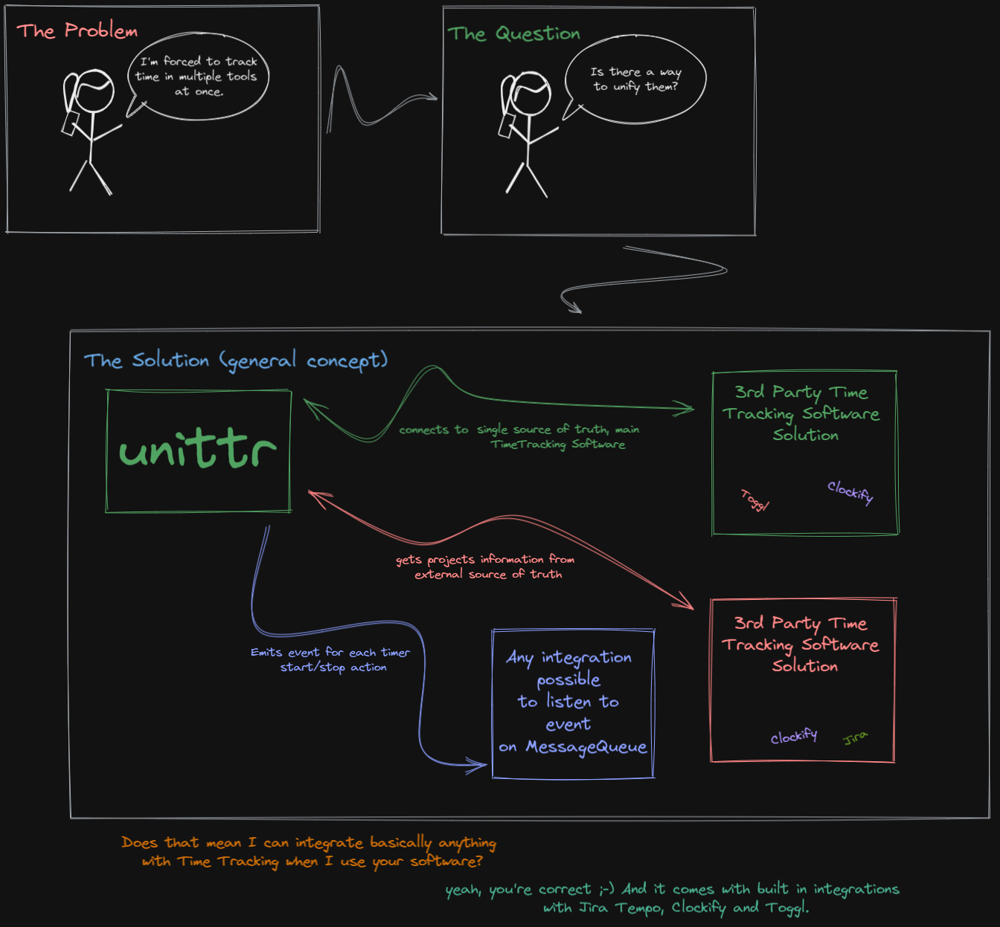

# unittr


Project progress: 
Project status: full development focus

## Why

In past 7 years of my profesional life companies I've worked with forced me to use Time Tracking software
such as Clockify, Toggl etc. Over the years I've grown up to not be pissed about it anymore and I've started
tracking even my own activities on my personal projects and even more, personal life.

But... At the end of the day I've landed with using three tools at once. How? Don't ask me... I've built several tools and integrations 
in projects I use or still support for my clients. For example on every other week I track time for different clients on different tools.

You can't even imagine how many times I've accounted time for wrong client...

I'm in desperate need of a universal tool to "to bring them all and in the darkness bind them" in terms of Time and Task trackers.
So... Shall I make one?

[](https://github.com/sebastianluczak/unittr)

## Idea



## Goals:
- Universal Time Tracker
- Be able to track time using same tool with any platform
- Be able to integrate back and forth with time trackers (Toggl, Harvest)
- Be able to integrate back with task trackers (Jira, Trello etc.)
- Common CLI interface (powerfull yet easy as hell to use)
- IDE integration ?
- Able to connect to API
- Some simple web interface ?
- self hosted (free, docker provided) or in cloud (in future, paid option?)
- Open-Source as much as possible
- messaging system to notify user for running tasks

### Example usage (CLI)

Cli is going to be main interface for communication in V1.

#### Example 1:

Tracking time for JIRA task 

```
$ unittr list
- MD3-1 Description Task 1
- MD3-2 Description Task 2
$ unittr start MD3-1
$ sleep(1200000)
$ unittr task status
[MD3-1] Running for 03:22:13, started at 13:11
$ unittr status
Today: 07h12m
[MD3-1] 03:22:13 and running
[MD2-2] 03:50:12
$ unittr stop
[MD3-1] 03:22:13
```

#### Example 2:

Config of tool

```
$ unittr config
Connected Task Tracker: NONE
Connected Time Tracker: NONE
$ unittr config task-tracker
Unittr Config Wizard
--- 
Choose Task Tracker:
1. JIRA
2. Trello
[1,2] 1

Provide JIRA API Key: *************

Please wait...
[JIRA CONNECTED]
$ unittr config
Connected Task Tracker: JIRA
Connected Time Tracker: NONE
$ unittr config time-tracker
Unittr Config Wizard
--- 
Choose Time Tracker:
1. Toggl
2. Clockify
[1,2] 1

Provide Toggl API Key: *************

Please wait...
[TOGGL CONNECTED]
```

## PRE-MORTEM

### Threads
- not much time on my hands to deal with it alone
- self-motivation going down when somethings not working
- php-roguelike will be affected negativaly
- zero to none audience interested in this kind of solution

# PoC

PoC has been created and is currently under heavy testing. Clockify and JIRA Worklog integration are working seemlesly and closely to examples listed above.
Development is concentrated around one private repository because at this moment it's implementation is strictly tied to accounts and processes within my organization.

As soon as I derive functionality and hide it under interfaces I'll share it publicly as an unittr open source project.
```
todo
```
